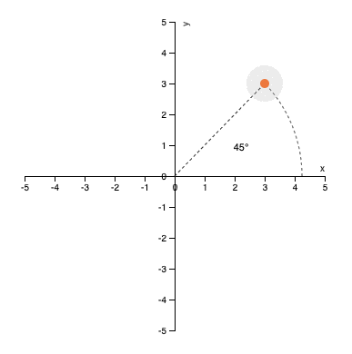

<p align="center"><a href="https://iooxa.dev"></a></p>

# @iooxa/svg

[](https://www.npmjs.com/package/@iooxa/svg)
[](https://github.com/iooxa/svg/blob/master/LICENSE)
[](https://iooxa.dev)

The goal of `@iooxa/svg` is to provide web-components for interactive scientific writing, reactive documents and [explorable explanations](https://explorabl.es). This library provides basic charting and diagram capabilities through basic, reactive SVG graphics.



```html
<r-var name="a" value="3"></r-var>
<r-var name="b" value="3"></r-var>
<r-var name="r" :value="Math.sqrt(a*a + b*b)"></r-var>
<r-svg-chart xlim="[-5, 5]" ylim="[-5, 5]" height="400" width="400" x-axis-location="origin" y-axis-location="origin" style="text-align: center;">
  <r-svg-eqn :domain="[0, Math.atan2(b, a)]" eqn="[r * Math.cos(t), r * Math.sin(t)]" parameterize="t" stroke="#333" stroke-width="1" stroke-dasharray="3"></r-svg-eqn>
  <r-svg-path :data="[[0, 0],[r * Math.cos(Math.atan2(b, a)), r * Math.sin(Math.atan2(b, a))]]" stroke="#333" stroke-width="1" stroke-dasharray="3"></r-svg-path>
  <r-svg-text :x="(r/2) * Math.cos(Math.atan2(b, a) / 2)" :y="(r/2) * Math.sin(Math.atan2(b, a) / 2)" :text="Math.round(Math.atan2(b, a)*180/Math.PI) + '°'"></r-svg-text>
  <r-svg-node :x="a" :y="b" :drag="{a: x, b: y}" fill="#ff7f0e"></r-svg-node>
</r-svg-chart>
```

## Getting Started

`@iooxa/svg` is based on web-components, which creates custom HTML tags so that they can make writing documents easier.
To get started, copy the built javascript file to the head of your page:

```html
<script src="https://unpkg.com/@iooxa/svg"></script>
```

You can also download the [latest release](https://github.com/iooxa/svg/releases) from GitHub. If you are running this without a web server, ensure the script has `charset="utf-8"` in the script tag. You can also [install from npm](https://www.npmjs.com/package/@iooxa/svg):

```bash
>> npm install @iooxa/svg
```

You should then be able to extend the package as you see fit:

```javascript
import components from '@iooxa/svg';
```

Note that the npm module does not setup the [@iooxa/runtime](https://github.com/iooxa/runtime) store, nor does it register the components. See the [iooxa.ts](/iooxa.ts) file for what the built package does to `setup` the store and `register` the components.

## Documentation

See https://iooxa.dev for full documentation.

## Basic Components

* r-svg-chart
* r-svg-text
* r-svg-path
* r-svg-eqn
* r-svg-circle
* r-svg-image
* r-svg-node
